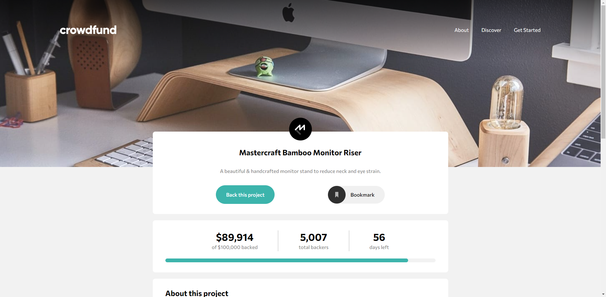
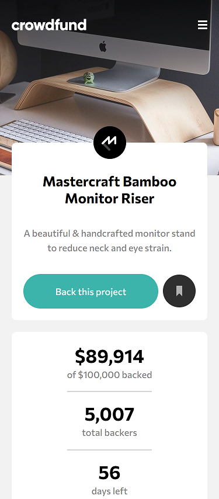

# Welcome! 👋

This is a solution to the [Crowdfunding product page challenge on Frontend Mentor](https://www.frontendmentor.io/challenges/crowdfunding-product-page-7uvcZe7ZR). Frontend Mentor challenges help you improve your coding skills by building realistic projects. 

## Table of contents

- [Overview](#overview)
  - [The challenge](#the-challenge)
  - [Screenshot](#screenshot)
  - [Links](#links)
- [My process](#my-process)
  - [Built with](#built-with)
  - [What I learned](#what-i-learned)
  - [Continued development](#continued-development)
- [Author](#author)

## Overview

### The challenge

Users should be able to:

- View the optimal layout depending on their device's screen size
- See hover states for interactive elements
- Make a selection of which pledge to make
- See an updated progress bar and total money raised based on their pledge total after confirming a pledge
- See the number of total backers increment by one after confirming a pledge
- Toggle whether or not the product is bookmarked

### Screenshot

|  |  |
| ------------------------------ | ----------------------------- |
| Desktop version                | Mobile version                |

### Links

- Solution URL: [Add solution URL here](https://your-solution-url.com)
- Live Site URL: [https://tyran0-crowdfunding-product-page.netlify.app/](https://tyran0-crowdfunding-product-page.netlify.app/)

## My process

### Built with

- Semantic HTML5 markup
- CSS custom properties
- CSS Flexbox
- CSS Grid
- ES modules

### What I learned

Instead of writing all of my JavaScript code in a single file, I decided to try out ES modules. So, first you have to specify a type for your script (this will be our entry point, which in my case 'index.js') in order to use modules. Otherwise nothing will work and throw an error.

```html
<script type="module" src="./js/index.js">
```

Then in your entry point file you put this:

```javascript
import { ... } from "./helpers.js";
```

This makes whatever there is in your module (in 'helpers.js') available for your entry point file.
Inside of curly brackets, you have to put any variables or functions you want to use.
And lastly, inside of your module:

```javascript
export const someVariable = ...;
export someFunction = () => ...;
```

In order to import something, you need to prepend it with 'export'. There's also default exports (which would be 'export default'), the only differences from regular exports are: you don't need to put them in curly brackets and there can only be one default export per module.

### Continued development

I've used constructor functions throughout this project, but only to realize that I was doing this for the sake of doing, not because I needed them. I see that I don't fully understand when to use which programming paradigm, so I'd have to work on that.

Also, I still didn't use mobile-first workflow, which I should, because people mostly use phones to browse the web. Will work on that in the next project.

## Author

- Frontend Mentor - [@tyran0](https://www.frontendmentor.io/profile/tyran0)